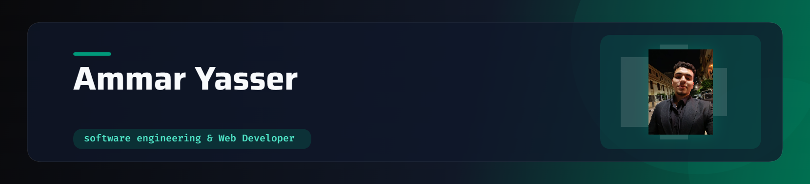

  <!-- Banner -->
  <!-- لو رفعت الصورة باسم مختلف، غير banner.png لاسم صورتك -->
  

    

  <!-- Title & Animated Typing Text -->
  <h1>Hey there, I'm Ammar-Yasser </h1>

  

    

  <!-- Blue Badges -->
  

    
    
    
  

 

<!-- About Me Section -->
<table border="0" width="100%">
  <tr>
    <td width="65%" valign="top">
      <h2>✨ About Me</h2>
      

        I am a <b>Computer Engineering Student</b> passionate about writing clean code and solving complex problems. I enjoy competitive programming and building responsive, interactive web interfaces.
      

      <ul>
        <li>🔭 <b>Currently working on:</b> Improving my Frontend skills (HTML, CSS, JS) & expanding my project portfolio</li>
        <li>🌱 <b>Currently focused on:</b> Algorithmic problem solving with C++</li>
        <li>👯 <b>Looking to collaborate on:</b> Open source projects and innovative web applications</li>
        <li>💬 <b>Ask me about:</b> C++, Web Development, and Arduino projects</li>
        <li>⚡ <b>Fun fact:</b> When I'm not coding, I'm probably mastering my parry skills in Sekiro: Shadows Die Twice!</li>
      </ul>
    </td>
    <td width="35%" align="center" valign="middle">
      
    </td>
  </tr>
</table>

 

<!-- Tech Stack -->

  <h2>🛠️ Tech Stack</h2>
   
  

  

<!-- GitHub Stats & Streak Section -->

  <h2>📈 GitHub Analytics</h2>
   
  

    
    &nbsp;&nbsp;
    
  

  

<!-- Contribution Snake -->

  <h2>🐍 Contribution Snake</h2>
   
  <picture>
    <source media="(prefers-color-scheme: dark)" srcset="https://raw.githubusercontent.com/Ammar-coder-2029/Ammar-coder-2029/output/github-snake-dark.svg">
    <source media="(prefers-color-scheme: light)" srcset="https://raw.githubusercontent.com/Ammar-coder-2029/Ammar-coder-2029/output/github-snake.svg">
    
  </picture>

  

<!-- Connect Section -->

  <h2>🌐 Connect With Me</h2>
   
  

       
       
    <!-- يمكنك إزالة الروابط التالية إذا كنت لا تستخدمها، أو إضافة اليوزر الخاص بك مكان الأقواس المربعة -->
       
      
  

  

<!-- Footer -->

  

